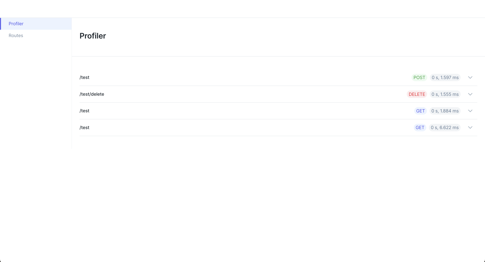

# Reapit Ludicrous 

A collection of tiny TypeScript frameworks built specifically for cli, Lambda and related handling.


## Packages

- <a href="packages/framework">Framework</a>
- <a href="packages/cli">cli</a>
- <a href="packages/lambda-http">lambda-http</a>
- <a href="packages/lambda-exec/">lambda-exec</a>
- <a href="packages/lambda-dev/">lambda-dev</a>

### Framework
[See docs](packages/framework)

The `@reapit-ludicrous/framework` package is a small DI application container. Designed to store metadata about a series of given classes and resolve their instanced state when requested and cache their instance for future requests.

### Lambda-http
[See docs](packages/lambda-http)

The `@reapit-ludicrous/lambda-http` package an extention of the `framework` package that also includes http handling specifically for lambda proxy api gateway requests. 
The package includes everything the framework package offers plus http-ness stuffs.

#### Http Controllers

```ts
import { Controller, Get } from '@reapit-ludicrous/lambda-http'

@Controller('my-controller')
class MyController {
  @Get('my-method')
  async myMethod() {}
}
```

#### Booting application

```ts
import { Boot } from '@reapit-ludicrous/lambda-http'

const application = Boot.application({
  providers: [MyController],
})
```

The above will now resolve routes `my-controller/my-method` to `MyController.myMethod()`

#### Http Decorators

```ts
import { Controller, Get, Param, Query } from '@reapit-ludicrous/lambda-http'

@Controller('things')
class MyController {
  @Get(':id')
  async myMethod(
    @Param('id') id: string,
    @Query('sort') sort?: string,
  ) {}
}
```
The above example will resolve the parameter within the path `things/12345` where `12345` is parameter named `id`. To the `id` property of the method. 
If a query string is present (`things/12345?sort=asc`) with a key of `sort` it will be provided to the `sort` property on the method.

### Lambda-dev

Lambda dev is a small development server that will enable the running of lambda-http application on your local machine complete with telemetry.

```ts
import { Boot } from '@reapit-ludicrous/lambda-http'
import { serve } from '@reapit-ludicrous/lambda-dev'

const application = Boot.application({
  providers: [TestController],
})

serve({ application })

```

Now navigate to `localhost:3000` and view the profiler



### Cli
[See docs](packages/cli)

A Tiny containerised Cli framework for providing mutli command based actions

```ts
import { Command, Arg, Boot } from '@reapit-ludicrous/cli'

@Command({
  name: 'my-command',
  description: 'This is an example command',
})
class MyCommand extends AbstractCommand {
  run(
    @Arg({
      name: 'argument',
      description: 'an example argument',
    })
    argument: string,
    @Arg({
      name: 'optional',
      description: 'an example of an optional boolean',
      type: 'boolean',
      alias: 'o',
    })
    optional: boolean,
  ) {
    console.log('arguments', argument, options)
  }
}

const cli = new Boot()

cli.run({
  commandName: 'my-command-name',
  commands: [ MyCommand ],
})
```

The above can then be ran by `index.ts my-command --argument test -o`

